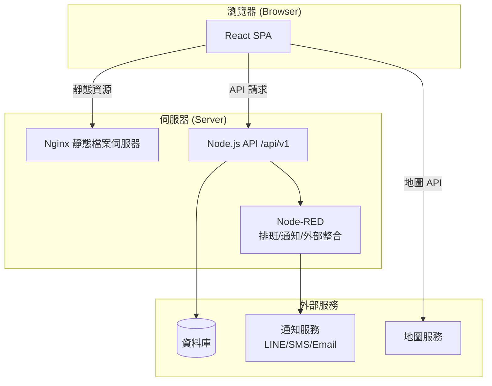
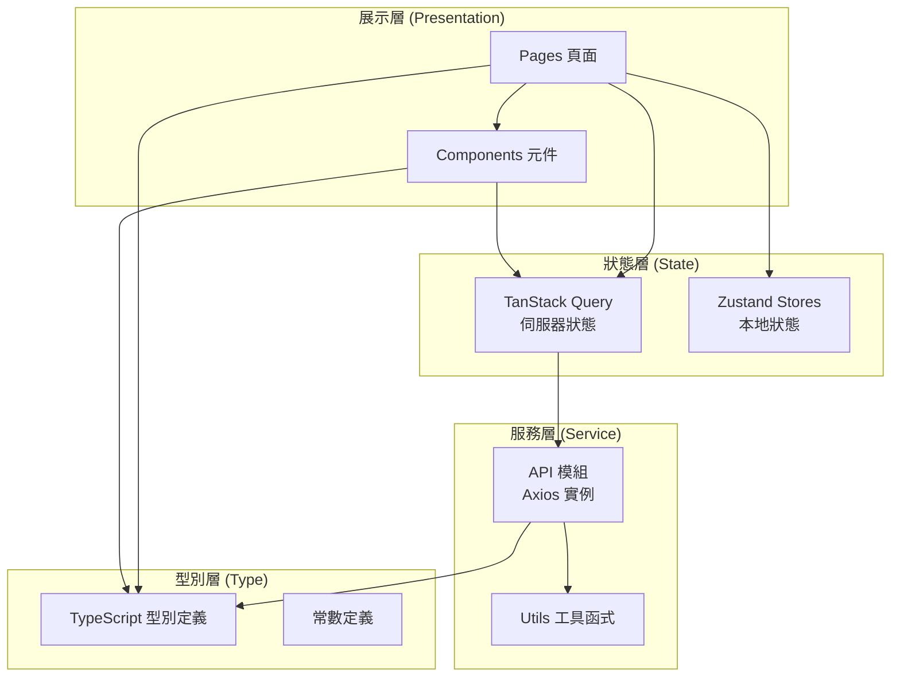
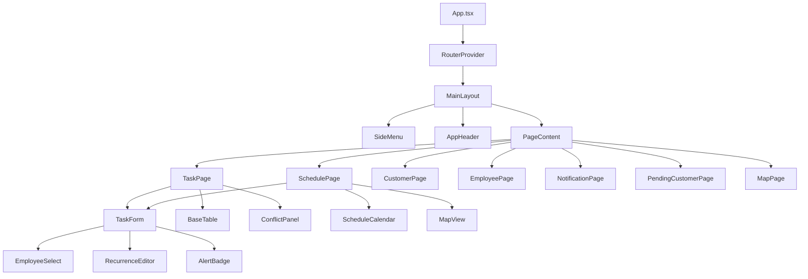
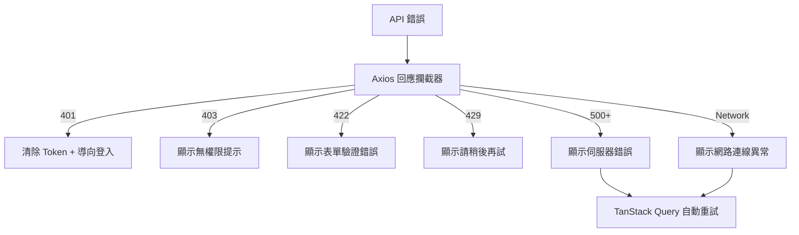
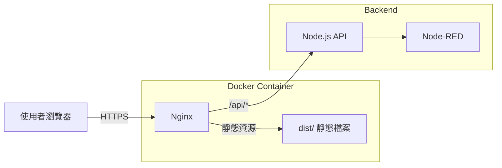

# 技術設計文件：藝康排班系統前端

## 概述 (Overview)

藝康排班系統為一套 React SPA 前端應用程式，架構以 React 18+、TypeScript、Vite 5+ 為核心，搭配 Ant Design 5 UI 框架與 FullCalendar v6 行事曆元件。系統涵蓋客戶任務派工、員工排班、警示預防、通知審批等核心業務，目標為提供直覺化排班管理介面，並確保資料一致性與排班規則合規性。

### 設計目標

1. **模組化架構**：按業務領域切分模組，各模組獨立維護
2. **即時預檢機制**：前端警示引擎即時檢查 6 項排班規則，降低不合規排班風險
3. **高效能行事曆渲染**：100 人 × 31 天排班資料首次渲染 ≤ 1.5 秒
4. **響應式設計**：桌面至行動裝置自適應佈局
5. **型別安全**：全面 TypeScript 嚴格模式，端到端型別覆蓋
6. **權限驅動 UI**：根據角色與權限代碼動態控制路由、選單、按鈕

### 技術棧

| 類別        | 技術選型                                    |
| ----------- | ------------------------------------------- |
| 框架        | React 18+, TypeScript 5+, Vite 5+           |
| UI 框架     | Ant Design 5                                |
| 行事曆      | FullCalendar v6 + resourceTimeline          |
| 路由        | React Router 6+                             |
| 伺服器狀態  | TanStack Query v5                           |
| 本地狀態    | Zustand 4+                                  |
| HTTP 客戶端 | Axios                                       |
| 日期處理    | Day.js + timezone + isoWeek                 |
| 匯出        | SheetJS (xlsx)                              |
| 圖表        | ECharts 5 (預留)                            |
| 測試        | Vitest + React Testing Library + Playwright |
| 程式碼標準  | ESLint + Prettier + Husky + lint-staged     |

---

## 架構 (Architecture)

### 系統架構圖



### 前端分層架構



### 目錄結構

```
src/
├── api/                    # 業務領域 API 模組
│   ├── auth.ts            # 認證 API
│   ├── task.ts            # 任務 API
│   ├── schedule.ts        # 排班 API
│   ├── customer.ts        # 客戶 API
│   ├── employee.ts        # 員工 API
│   ├── notification.ts    # 通知 API
│   ├── approval.ts        # 審批 API
│   ├── pending-customer.ts # 待定客戶 API
│   └── instance.ts        # Axios 實例與攔截器
├── components/
│   ├── base/              # 基礎元件
│   │   ├── BaseTable/     # 通用表格（分頁、排序、響應式卡片）
│   │   ├── BaseModal/     # 通用 Modal
│   │   ├── BaseSearchForm/# 搜尋表單
│   │   └── BaseUpload/    # 檔案上傳
│   └── business/          # 業務元件
│       ├── TaskForm/      # 任務表單
│       ├── ScheduleCalendar/ # 排班行事曆
│       ├── EmployeeSelect/# 員工選擇器
│       ├── ConflictPanel/ # 衝突面板
│       ├── AlertBadge/    # 警示標記
│       ├── RecurrenceEditor/ # 週期編輯器
│       ├── NotificationCenter/ # 通知中心
│       └── MapView/       # 地圖檢視
├── pages/                 # 頁面目錄
│   ├── login/
│   ├── dashboard/
│   ├── task/
│   ├── schedule/
│   ├── customer/
│   ├── employee/
│   ├── notification/
│   ├── pending-customer/
│   ├── approval/
│   ├── map/
│   └── 403.tsx
├── routes/                # 路由設定
│   ├── index.tsx          # 路由配置
│   ├── guards.tsx         # 權限守衛
│   └── modules/           # 路由模組按業務切分
├── queries/               # TanStack Query hooks
│   ├── useTaskQueries.ts
│   ├── useScheduleQueries.ts
│   ├── useCustomerQueries.ts
│   ├── useEmployeeQueries.ts
│   ├── useNotificationQueries.ts
│   └── usePendingCustomerQueries.ts
├── stores/                # Zustand stores
│   ├── useUserStore.ts
│   ├── usePermissionStore.ts
│   ├── useDictStore.ts
│   ├── useTaskStore.ts
│   ├── useScheduleStore.ts
│   └── useAppStore.ts
├── constants/             # 常數定義
│   ├── taskStatus.ts
│   ├── licenseTypes.ts
│   ├── positions.ts
│   ├── notificationTypes.ts
│   ├── errorCodes.ts
│   └── permissions.ts
├── utils/                 # 工具函式
│   ├── date.ts            # 日期處理
│   ├── validation.ts      # 表單驗證
│   ├── format.ts          # 格式化
│   ├── excel.ts           # Excel 下載
│   ├── colorContrast.ts   # 色彩對比度
│   └── alertRules.ts      # 警示規則引擎
├── styles/                # 樣式
│   ├── tokens.ts          # Design tokens
│   ├── antd-theme.ts      # Ant Design 主題覆蓋
│   └── global.css         # 全域樣式
├── types/                 # TypeScript 型別
│   ├── auth.ts
│   ├── task.ts
│   ├── schedule.ts
│   ├── customer.ts
│   ├── employee.ts
│   ├── notification.ts
│   ├── alert.ts
│   └── common.ts
├── i18n/                  # 國際化
│   ├── index.ts
│   ├── zh-TW/
│   └── en-US/
├── App.tsx
├── main.tsx
└── vite-env.d.ts
```

---

## 元件與介面 (Components and Interfaces)

### 核心元件關係圖



### 基礎元件介面

#### BaseTable

通用表格元件，封裝 Ant Design Table 並加入響應式卡片模式與分頁邏輯。

```typescript
interface BaseTableProps<T extends Record<string, unknown>> {
  columns: ColumnDef<T>[];
  queryHook: () => UseQueryResult<PaginatedResponse<T>>;
  searchFields?: SearchFieldConfig[];
  exportable?: boolean;
  onRowClick?: (record: T) => void;
  cardRender?: (record: T) => ReactNode; // 小螢幕卡片渲染
  rowKey?: string | ((record: T) => string);
}
```

#### BaseModal

通用 Modal 元件，統一確認/取消行為與載入狀態。

```typescript
interface BaseModalProps {
  title: string;
  open: boolean;
  onOk: () => Promise<void> | void;
  onCancel: () => void;
  loading?: boolean;
  width?: number | string;
  children: ReactNode;
}
```

#### BaseSearchForm

通用搜尋表單元件，支援多欄位搜尋與重置。

```typescript
interface BaseSearchFormProps {
  fields: SearchFieldConfig[];
  onSearch: (values: Record<string, unknown>) => void;
  onReset: () => void;
  loading?: boolean;
}

interface SearchFieldConfig {
  name: string;
  label: string;
  type: 'input' | 'select' | 'datePicker' | 'rangePicker' | 'cascader';
  options?: SelectOption[];
  placeholder?: string;
}
```

### 業務元件介面

#### TaskForm

任務建立/編輯表單，整合警示引擎預檢。

```typescript
interface TaskFormProps {
  mode: 'create' | 'edit';
  initialData?: Task;
  onSubmit: (task: TaskFormData) => Promise<void>;
  onCancel: () => void;
}

interface TaskFormData {
  groupId: string; // 集團（必填）
  branchId: string; // 分店（必填）
  taskType: TaskType; // 合約 | 單次 | ESR
  date: string; // ISO 8601
  startTime: string; // HH:mm
  endTime: string; // HH:mm（允許跨日）
  headcount: number; // 人數
  shift: ShiftType; // 班別
  route: string; // 路線
  contents: TaskContent[]; // 工作內容（多選）
  assignees: string[]; // 員工 IDs
  remarks?: string; // 備註
  recurrence?: RecurrenceRule; // 週期規則
}
```

#### ScheduleCalendar

排班行事曆元件，基於 FullCalendar v6 resourceTimeline。

```typescript
interface ScheduleCalendarProps {
  viewMode: 'day' | 'week' | 'month';
  dimension: 'customer' | 'employee';
  dateRange: { start: string; end: string };
  filters: ScheduleFilters;
  onEventClick: (event: ScheduleEvent) => void;
  onDateChange: (range: { start: string; end: string }) => void;
}

interface ScheduleFilters {
  groupId?: string;
  branchId?: string;
  employeeId?: string;
  areaId?: string;
}
```

#### EmployeeSelect

員工選擇器，支援群組/證照/休假狀態篩選。

```typescript
interface EmployeeSelectProps {
  value: string[];
  onChange: (ids: string[]) => void;
  date?: string; // 用於檢查休假狀態
  requiredLicenses?: LicenseType[]; // 高亮符合證照者
  multiple?: boolean;
}
```

#### ConflictPanel

衝突面板，顯示警示引擎預檢結果。

```typescript
interface ConflictPanelProps {
  violations: AlertViolation[];
  onOverride: (remark: string) => void;
  canOverride: boolean; // 根據權限判斷
}
```

#### RecurrenceEditor

週期任務編輯器，類似 Outlook 週期設定。

```typescript
interface RecurrenceEditorProps {
  value?: RecurrenceRule;
  onChange: (rule: RecurrenceRule) => void;
}

interface RecurrenceRule {
  frequency: 'daily' | 'weekly' | 'monthly' | 'custom';
  interval: number; // 間隔數
  daysOfWeek?: number[]; // 週幾 (0-6)
  dayOfMonth?: number; // 每月幾號
  endType: 'never' | 'date' | 'count';
  endDate?: string; // 結束日期
  endCount?: number; // 重複次數
}
```

#### AlertBadge

警示標記元件，用於行事曆事件方塊上。

```typescript
interface AlertBadgeProps {
  status: 'normal' | 'warning' | 'overridden' | 'recurring';
  tooltip?: string;
}
```

### API 模組介面

#### Axios 實例配置

```typescript
// src/api/instance.ts
const apiInstance = axios.create({
  baseURL: import.meta.env.VITE_API_BASE_URL + '/api/v1',
  timeout: 30000,
  headers: { 'Content-Type': 'application/json; charset=utf-8' },
});

// 請求攔截器：附加 Bearer Token
apiInstance.interceptors.request.use((config) => {
  const token = useUserStore.getState().token;
  if (token) {
    config.headers.Authorization = `Bearer ${token}`;
  }
  return config;
});

// 回應攔截器：處理 401/403 與全域錯誤
apiInstance.interceptors.response.use(
  (response) => response.data,
  (error) => {
    if (error.response?.status === 401) {
      useUserStore.getState().logout();
      window.location.href = '/login';
    }
    return Promise.reject(error);
  },
);
```

#### 主要 API 函式

```typescript
// src/api/auth.ts
export const authApi = {
  login: (credentials: LoginRequest) => apiInstance.post<LoginResponse>('/auth/login', credentials),
  getProfile: () => apiInstance.get<UserProfile>('/auth/profile'),
};

// src/api/task.ts
export const taskApi = {
  list: (params: TaskListParams, signal?: AbortSignal) =>
    apiInstance.get<PaginatedResponse<Task>>('/tasks', { params, signal }),
  create: (data: TaskFormData) => apiInstance.post<Task>('/tasks', data),
  update: (id: string, data: Partial<TaskFormData>) =>
    apiInstance.patch<Task>(`/tasks/${id}`, data),
  validate: (id: string, data: TaskFormData) =>
    apiInstance.post<AlertValidationResult>(`/tasks/${id}/validate`, data),
  overrideWarning: (id: string, remark: string) =>
    apiInstance.post(`/tasks/${id}/override-warning`, { remark }),
};

// src/api/schedule.ts
export const scheduleApi = {
  get: (params: ScheduleParams, signal?: AbortSignal) =>
    apiInstance.get<ScheduleData>('/schedule', { params, signal }),
  update: (data: ScheduleUpdateData) => apiInstance.patch('/schedule', data),
};
```

### 路由守衛設計

```typescript
// src/routes/guards.tsx
interface RouteGuardProps {
  requiredPermissions?: string[];
  requiredRoles?: RoleType[];
  children: ReactNode;
}

const RouteGuard: FC<RouteGuardProps> = ({ requiredPermissions, requiredRoles, children }) => {
  const { token, role } = useUserStore();
  const { hasPermission } = usePermissionStore();

  if (!token) return <Navigate to="/login" replace />;
  if (requiredRoles && !requiredRoles.includes(role)) return <Navigate to="/403" replace />;
  if (requiredPermissions && !requiredPermissions.every(hasPermission)) return <Navigate to="/403" replace />;

  return <>{children}</>;
};
```

---

## 資料模型 (Data Models)

### 核心型別定義

```typescript
// src/types/auth.ts
interface LoginRequest {
  account: string; // 帳號或員工編號
  password: string;
  captcha?: string; // 連續失敗三次後必填
  rememberMe?: boolean;
}

interface LoginResponse {
  accessToken: string;
  refreshToken?: string;
  expiresIn: number;
  user: UserProfile;
}

interface UserProfile {
  id: string;
  name: string;
  employeeNo: string;
  role: RoleType;
  permissions: string[]; // 權限代碼陣列
  groupId?: string;
}

type RoleType = 'ADMIN' | 'ADMIN_STAFF' | 'MANAGER' | 'DIRECTOR' | 'LEADER' | 'STAFF' | 'SALES_OPS';
```

```typescript
// src/types/task.ts
interface Task {
  id: string;
  groupId: string;
  groupName: string;
  branchId: string;
  branchName: string;
  taskType: TaskType;
  date: string; // ISO 8601
  startTime: string; // HH:mm
  endTime: string; // HH:mm
  isOvernight: boolean; // 是否跨日
  headcount: number;
  shift: ShiftType;
  route: string;
  contents: TaskContent[];
  assignees: TaskAssignee[];
  remarks?: string;
  recurrenceId?: string; // 所屬週期任務 ID
  recurrenceRule?: RecurrenceRule;
  status: TaskStatus;
  alertStatus: AlertStatus;
  overrideRemark?: string;
  createdBy: string;
  createdAt: string;
  updatedAt: string;
}

type TaskType = 'CONTRACT' | 'ONETIME' | 'ESR';
type TaskStatus = 'DRAFT' | 'SCHEDULED' | 'COMPLETED' | 'CANCELLED';
type AlertStatus = 'CLEAN' | 'VIOLATED' | 'OVERRIDDEN';
type ShiftType = 'DAY' | 'NIGHT' | 'FLEXIBLE';
type TaskContent =
  | 'P'
  | 'R'
  | 'S'
  | 'TERMITE'
  | 'FIRE_ANT'
  | 'BED_BUG'
  | 'VEHICLE_MAINTENANCE'
  | 'TRAINING'
  | 'OTHER';

interface TaskAssignee {
  employeeId: string;
  employeeName: string;
  licenses: LicenseType[];
}
```

```typescript
// src/types/employee.ts
interface Employee {
  id: string;
  name: string;
  phone: string;
  employeeNo: string;
  position: PositionType;
  groupId: string;
  groupName: string;
  groupColor: string;
  designatedLeaves: string[]; // ISO 日期陣列
  licenses: LicenseType[];
  isActive: boolean;
}

type PositionType = 'MANAGER' | 'DIRECTOR' | 'LEADER' | 'STAFF' | 'SALES_OPS';
type LicenseType =
  | 'NONE'
  | 'PROFESSIONAL'
  | 'PEST_CONTROL'
  | 'FIRE_ANT'
  | 'SAFETY_6HR'
  | 'SAFETY_MANAGER_A'
  | 'SAFETY_MANAGER_B'
  | 'SAFETY_MANAGER_C';
```

```typescript
// src/types/customer.ts
interface Customer {
  id: string;
  groupId: string;
  groupName: string;
  branchId: string;
  branchName: string;
  address: string;
  latitude?: number;
  longitude?: number;
  contactName: string;
  contactPhone: string;
  requiredLicenses: LicenseType[];
  remarks?: string;
}

interface CustomerGroup {
  id: string;
  name: string;
  branches: CustomerBranch[];
}

interface CustomerBranch {
  id: string;
  groupId: string;
  name: string;
  address: string;
  latitude?: number;
  longitude?: number;
  contactName: string;
  contactPhone: string;
  requiredLicenses: LicenseType[];
}
```

```typescript
// src/types/schedule.ts
interface ScheduleEvent {
  id: string;
  taskId: string;
  resourceId: string; // 員工 ID 或分店 ID（依維度）
  title: string;
  start: string; // ISO 8601
  end: string; // ISO 8601
  groupName: string;
  branchName: string;
  alertStatus: AlertStatus;
  isRecurring: boolean;
  isOvernight: boolean;
  backgroundColor?: string;
  borderColor?: string;
  extendedProps: {
    taskType: TaskType;
    shift: ShiftType;
    assignees: TaskAssignee[];
    contents: TaskContent[];
  };
}

interface ScheduleData {
  events: ScheduleEvent[];
  resources: ScheduleResource[];
}

interface ScheduleResource {
  id: string;
  title: string;
  groupColor?: string;
  children?: ScheduleResource[];
}
```

```typescript
// src/types/notification.ts
interface Notification {
  id: string;
  type: NotificationType;
  templateId?: string;
  recipientType: 'CUSTOMER' | 'EMPLOYEE';
  recipientId: string;
  recipientName: string;
  subject: string;
  content: string;
  status: NotificationStatus;
  taskId?: string;
  sentAt?: string;
  createdAt: string;
}

type NotificationType =
  | 'SCHEDULE_REMINDER'
  | 'CUSTOMER_NOTIFY'
  | 'EMPLOYEE_DISPATCH'
  | 'CHANGE_APPROVAL'
  | 'APPROVAL_RESULT';
type NotificationStatus = 'NOTIFIED' | 'NOT_NOTIFIED' | 'CHANGED_NOTIFIED' | 'CHANGED_NOT_NOTIFIED';

interface NotificationTemplate {
  id: string;
  name: string;
  type: NotificationType;
  subject: string;
  content: string;
  variables: string[]; // 可替換變數
}
```

```typescript
// src/types/alert.ts
interface AlertViolation {
  ruleId: AlertRuleId;
  severity: 'BLOCKING';
  message: string;
  details: Record<string, unknown>;
  affectedEmployees?: string[];
}

type AlertRuleId =
  | 'LICENSE_REQUIRED' // 規則 1：證照要求
  | 'CONSECUTIVE_DAYS' // 規則 2：連續七日
  | 'DAILY_HOURS_EXCEEDED' // 規則 3：日工時超過十小時
  | 'DUPLICATE_SLOT' // 規則 4：同時段重複
  | 'DESIGNATED_LEAVE' // 規則 5：指定休假
  | 'HEADCOUNT_BELOW_MIN'; // 規則 6：人數不足

interface AlertValidationResult {
  isValid: boolean;
  violations: AlertViolation[];
  canOverride: boolean;
}

// 警示規則檢查函式型別
type AlertRuleChecker = (task: TaskFormData, context: AlertContext) => AlertViolation | null;

interface AlertContext {
  employees: Employee[];
  existingTasks: Task[]; // 相關員工的現有排班
  customerLicenses: LicenseType[]; // 客戶要求之證照
  holidays: string[]; // 國定假日
}
```

```typescript
// src/types/common.ts
interface PaginatedResponse<T> {
  data: T[];
  total: number;
  page: number;
  pageSize: number;
}

interface ApiResponse<T> {
  code: number;
  message: string;
  data: T;
}

interface SelectOption {
  label: string;
  value: string | number;
  children?: SelectOption[];
  disabled?: boolean;
}
```

### 狀態管理 Store 模型

```typescript
// src/stores/useUserStore.ts
interface UserState {
  token: string | null;
  user: UserProfile | null;
  loginFailCount: number;
  login: (credentials: LoginRequest) => Promise<void>;
  logout: () => void;
  setToken: (token: string) => void;
}

// src/stores/usePermissionStore.ts
interface PermissionState {
  accessibleRoutes: RouteConfig[];
  menuTree: MenuItem[];
  permissionCodes: Set<string>;
  buildPermissions: (permissions: string[], role: RoleType) => void;
  hasPermission: (code: string) => boolean;
  hasRole: (role: RoleType) => boolean;
}

// src/stores/useDictStore.ts
interface DictState {
  taskTypes: SelectOption[];
  shifts: SelectOption[];
  routes: SelectOption[];
  contents: SelectOption[];
  licenses: SelectOption[];
  positions: SelectOption[];
  groups: SelectOption[];
  version: string;
  loadDict: () => Promise<void>;
}

// src/stores/useTaskStore.ts
interface TaskState {
  filters: TaskListParams;
  formDraft: Partial<TaskFormData> | null;
  alertResults: AlertValidationResult | null;
  setFilters: (filters: Partial<TaskListParams>) => void;
  setFormDraft: (draft: Partial<TaskFormData> | null) => void;
  setAlertResults: (results: AlertValidationResult | null) => void;
}

// src/stores/useScheduleStore.ts
interface ScheduleState {
  currentView: 'day' | 'week' | 'month';
  dimension: 'customer' | 'employee';
  dateRange: { start: string; end: string };
  changeBuffer: ScheduleChange[];
  conflictList: AlertViolation[];
  undoStack: ScheduleChange[];
  setView: (view: 'day' | 'week' | 'month') => void;
  setDimension: (dim: 'customer' | 'employee') => void;
  pushChange: (change: ScheduleChange) => void;
  undo: () => void;
}

// src/stores/useAppStore.ts
interface AppState {
  sidebarCollapsed: boolean;
  theme: 'light' | 'dark';
  locale: 'zh-TW' | 'en-US';
  tabs: TabItem[];
  toggleSidebar: () => void;
  setLocale: (locale: 'zh-TW' | 'en-US') => void;
  addTab: (tab: TabItem) => void;
  removeTab: (key: string) => void;
}
```

### 警示引擎核心邏輯

```typescript
// src/utils/alertRules.ts

/**
 * 警示規則引擎 - 前端即時預檢
 * 後端檢查為權威結果，前端預檢輔助使用者
 */

// 規則 1：證照要求
const checkLicenseRequired: AlertRuleChecker = (task, context) => {
  const { customerLicenses, employees } = context;
  if (customerLicenses.length === 0) return null;

  const assignedEmployees = employees.filter((e) => task.assignees.includes(e.id));
  const hasQualified = assignedEmployees.some((e) =>
    customerLicenses.every((lic) => e.licenses.includes(lic)),
  );

  if (!hasQualified) {
    return {
      ruleId: 'LICENSE_REQUIRED',
      severity: 'BLOCKING',
      message: '指派員工中無人持有客戶要求之證照',
      details: { required: customerLicenses },
      affectedEmployees: task.assignees,
    };
  }
  return null;
};

// 規則 2：連續工作超過七日
const checkConsecutiveDays: AlertRuleChecker = (task, context) => {
  // 對每位指派員工，檢查加入本任務後是否連續 > 7 日
  const violations: string[] = [];
  for (const empId of task.assignees) {
    const empTasks = context.existingTasks.filter((t) =>
      t.assignees.some((a) => a.employeeId === empId),
    );
    // 計算包含本任務日期後的最長連續工作天數
    if (getMaxConsecutiveDays(empTasks, task.date) > 7) {
      violations.push(empId);
    }
  }
  if (violations.length > 0) {
    return {
      ruleId: 'CONSECUTIVE_DAYS',
      severity: 'BLOCKING',
      message: '指派員工連續工作超過七日',
      details: { maxAllowed: 7 },
      affectedEmployees: violations,
    };
  }
  return null;
};

// 規則 3：日工時超過十小時
const checkDailyHoursExceeded: AlertRuleChecker = (task, context) => {
  const violations: string[] = [];
  for (const empId of task.assignees) {
    const dayTasks = context.existingTasks.filter(
      (t) => t.date === task.date && t.assignees.some((a) => a.employeeId === empId),
    );
    const totalHours = calculateTotalHours(dayTasks, task);
    if (totalHours > 10) {
      violations.push(empId);
    }
  }
  if (violations.length > 0) {
    return {
      ruleId: 'DAILY_HOURS_EXCEEDED',
      severity: 'BLOCKING',
      message: '指派員工當日工時超過十小時',
      details: { maxAllowed: 10 },
      affectedEmployees: violations,
    };
  }
  return null;
};

// 規則 4：同時段重複排班
const checkDuplicateSlot: AlertRuleChecker = (task, context) => {
  const violations: string[] = [];
  for (const empId of task.assignees) {
    const overlapping = context.existingTasks.find(
      (t) =>
        t.date === task.date &&
        t.assignees.some((a) => a.employeeId === empId) &&
        isTimeOverlap(t.startTime, t.endTime, task.startTime, task.endTime),
    );
    if (overlapping) violations.push(empId);
  }
  if (violations.length > 0) {
    return {
      ruleId: 'DUPLICATE_SLOT',
      severity: 'BLOCKING',
      message: '指派員工於相同時段已有排班',
      details: {},
      affectedEmployees: violations,
    };
  }
  return null;
};

// 規則 5：指定休假日排班
const checkDesignatedLeave: AlertRuleChecker = (task, context) => {
  const violations: string[] = [];
  for (const empId of task.assignees) {
    const emp = context.employees.find((e) => e.id === empId);
    if (emp?.designatedLeaves.includes(task.date)) {
      violations.push(empId);
    }
  }
  if (violations.length > 0) {
    return {
      ruleId: 'DESIGNATED_LEAVE',
      severity: 'BLOCKING',
      message: '指派員工於指定休假日被排班',
      details: {},
      affectedEmployees: violations,
    };
  }
  return null;
};

// 規則 6：人數不足
const checkHeadcountBelowMin: AlertRuleChecker = (task, _context) => {
  if (task.assignees.length < task.headcount) {
    return {
      ruleId: 'HEADCOUNT_BELOW_MIN',
      severity: 'BLOCKING',
      message: '指派人數低於最低需求人數',
      details: { required: task.headcount, actual: task.assignees.length },
    };
  }
  return null;
};

// 主執行函式
export const runAlertChecks = (
  task: TaskFormData,
  context: AlertContext,
): AlertValidationResult => {
  const checkers: AlertRuleChecker[] = [
    checkLicenseRequired,
    checkConsecutiveDays,
    checkDailyHoursExceeded,
    checkDuplicateSlot,
    checkDesignatedLeave,
    checkHeadcountBelowMin,
  ];

  const violations = checkers
    .map((checker) => checker(task, context))
    .filter((v): v is AlertViolation => v !== null);

  return {
    isValid: violations.length === 0,
    violations,
    canOverride: true, // 後端決定是否允許覆蓋
  };
};
```

---

## 正確性屬性 (Correctness Properties)

_屬性（Property）是指在系統所有有效執行中應始終成立的特徵或行為——本質上是對系統應做之事的形式化陳述。屬性作為人類可讀的規格與機器可驗證之正確性保證之間的橋樑。_

以下屬性基於需求文件之驗收條件推導，每個屬性均以全稱量詞（for all / for any）表述，適用於屬性基礎測試（Property-Based Testing）。

### Property 1: 登入後使用者資料儲存完整性 (Login Profile Round-Trip)

_For any_ 有效的使用者設定檔（UserProfile），登入成功後存入 useUserStore 的資料應與 API 回傳之資料完全一致，包含角色、權限代碼、群組等所有欄位。

**Validates: Requirements 1.4**

### Property 2: API 請求 Bearer Token 附加

_For any_ 透過 Axios 實例發出之 API 請求，若 useUserStore 中存在有效 Token，則該請求之 Authorization 標頭應為 `Bearer <token>` 格式。

**Validates: Requirements 1.6, 19.4**

### Property 3: 角色路由生成正確性

_For any_ 有效的角色類型（RoleType），根據該角色生成之可存取路由清單應為全域路由表之合法子集，且選單樹中每個節點皆有對應之路由定義。

**Validates: Requirements 2.1**

### Property 4: 未授權路由阻擋

_For any_ 角色與任何不在該角色可存取路由清單中之路徑，路由守衛應將使用者導向 403 頁面。

**Validates: Requirements 2.2**

### Property 5: 權限代碼 UI 控制

_For any_ 權限代碼集合，頁面中受權限保護之 UI 元素（按鈕、操作）的顯示狀態應與該元素所需之權限代碼是否存在於集合中完全對應。

**Validates: Requirements 2.3**

### Property 6: 集團分店連動篩選

_For any_ 選定之集團，分店下拉選項應僅包含屬於該集團之分店，且不遺漏任何該集團分店。

**Validates: Requirements 3.2**

### Property 7: 跨日時間區間計算

_For any_ 起訖時間組合（包含跨日情境），系統計算之時間長度應正確反映實際工時：若 endTime ≤ startTime 則視為跨日，時長 = (24:00 - startTime) + endTime。

**Validates: Requirements 3.4**

### Property 8: 員工多條件篩選

_For any_ 群組、證照、休假狀態之篩選組合，員工選擇器回傳之結果應僅包含同時滿足所有啟用篩選條件之員工。

**Validates: Requirements 3.6**

### Property 9: 警示驗證閘門

_For any_ 任務表單資料，任務儲存應成功若且唯若（無違規項目 OR 已提供覆蓋備註）。若存在違規且無覆蓋，儲存應被阻擋；若存在違規但已覆蓋，任務狀態應標記為 OVERRIDDEN。

**Validates: Requirements 3.8, 7.7**

### Property 10: 模糊搜尋結果正確性

_For any_ 搜尋關鍵字與資料集合，搜尋結果中每筆記錄之集團名稱或分店名稱應包含該關鍵字（不區分大小寫）。

**Validates: Requirements 4.2, 10.4**

### Property 11: 週期任務生成

_For any_ 有效之週期規則（RecurrenceRule），系統產生之重複任務實例應完全符合規則定義：頻率、間隔、週幾/月幾號、結束條件皆正確對應。

**Validates: Requirements 5.2**

### Property 12: 匯出資料一致性

_For any_ 篩選條件與任務資料集，匯出之 Excel 檔案內容應與當前篩選結果之任務列表完全一致，欄位不遺漏、資料不錯位。

**Validates: Requirements 6.1**

### Property 13: 證照要求規則

_For any_ 具有證照要求之客戶任務與任意指派員工集合，警示引擎應產生違規若且唯若指派員工中無任何一人持有客戶所要求之全部證照。

**Validates: Requirements 7.1**

### Property 14: 連續工作日規則

_For any_ 員工之現有排班日期集合與新任務日期，警示引擎應產生違規若且唯若加入新任務日期後該員工存在超過七日之連續工作日。

**Validates: Requirements 7.2**

### Property 15: 每日工時規則

_For any_ 員工於同一日之所有任務時段（含新任務），警示引擎應產生違規若且唯若總工時超過十小時。

**Validates: Requirements 7.3**

### Property 16: 時間重疊偵測

_For any_ 兩個時間區間 [s1, e1] 與 [s2, e2]，重疊偵測函式應回傳 true 若且唯若 s1 < e2 且 s2 < e1（即兩區間非分離）。

**Validates: Requirements 7.4**

### Property 17: 指定休假規則

_For any_ 員工之指定休假日集合與任務日期，警示引擎應產生違規若且唯若任務日期存在於該員工之指定休假日集合中。

**Validates: Requirements 7.5**

### Property 18: 人數需求規則

_For any_ 任務之最低需求人數與實際指派員工數量，警示引擎應產生違規若且唯若指派人數小於需求人數。

**Validates: Requirements 7.6**

### Property 19: 行事曆事件方塊資訊完整性

_For any_ 排班事件（ScheduleEvent），渲染之事件方塊應包含集團名稱、分店名稱與時間區間資訊。

**Validates: Requirements 8.4**

### Property 20: 跨日事件時間跨度

_For any_ 跨日任務（endTime ≤ startTime），行事曆事件應跨越兩個日曆日顯示，其結束日期為起始日期之隔日。

**Validates: Requirements 8.5**

### Property 21: 群組色彩唯一性

_For any_ 兩個不同之員工群組，系統指派之色彩編碼應互不相同。

**Validates: Requirements 11.4**

### Property 22: 證照衝突驗證

_For any_ 員工證照設定組合，若該組合違反預定義之衝突規則，驗證函式應回傳錯誤訊息。

**Validates: Requirements 11.6**

### Property 23: 通知發送日期區間啟用

_For any_ 當月日期，手動通知發送功能應啟用若且唯若日期介於每月二十日至三十一日之間且存在新排班記錄。

**Validates: Requirements 12.2**

### Property 24: 通知狀態合法性

_For any_ 通知記錄，其狀態應為合法狀態值之一（已通知/未通知/已變更+已通知/已變更+未通知），且狀態轉換應符合預定義之狀態機規則。

**Validates: Requirements 12.3**

### Property 25: 稽核日誌建立

_For any_ 可稽核操作（排班變更、警示覆蓋、權限變更、刪除），系統應建立對應之稽核日誌記錄，包含操作類型、操作者、時間戳與變更內容。

**Validates: Requirements 13.4**

### Property 26: 待定客戶轉換正確性

_For any_ 具有有效服務時間之待定客戶，轉換為正式任務後應保留原始之集團、分店、聯絡人等資訊，且新任務之日期與時間應符合確認之服務時間。

**Validates: Requirements 14.3**

### Property 27: 地圖篩選正確性

_For any_ 篩選條件組合（集團、分店、群組），地圖上顯示之標記應僅包含符合所有篩選條件之客戶分店。

**Validates: Requirements 15.3**

### Property 28: 色彩對比度合規

_For any_ 設計 Token 中之前景/背景色彩組合，計算之對比度比值應 ≥ 4.5:1，符合 WCAG AA 等級要求。

**Validates: Requirements 16.6**

### Property 29: 防抖行為

_For any_ 在 200 毫秒內之連續輸入序列，驗證請求應僅在最後一次輸入後 200 毫秒觸發一次，中間輸入不應產生請求。

**Validates: Requirements 17.6**

### Property 30: ISO 8601 日期格式

_For any_ 系統產生之日期時間值（用於 API 傳輸），其格式應符合 ISO 8601 標準並包含時區資訊（例如 `2026-08-10T09:00:00+08:00`）。

**Validates: Requirements 18.4**

### Property 31: XSS 輸入跳脫

_For any_ 包含 HTML 特殊字元（`<`, `>`, `&`, `"`, `'`）之使用者輸入字串，經過跳脫處理函式後應將所有危險字元轉換為安全實體，且原始文字語義不變。

**Validates: Requirements 19.2**

---

## 錯誤處理 (Error Handling)

### 全域錯誤處理策略



### 錯誤分類與處理

| HTTP 狀態碼 | 錯誤類型   | 處理方式                                         |
| ----------- | ---------- | ------------------------------------------------ |
| 401         | 認證失效   | 清除本地狀態，導向 `/login`                      |
| 403         | 無權限     | Ant Design message.error 提示                    |
| 404         | 資源不存在 | 導向 404 頁面或提示                              |
| 422         | 驗證失敗   | 映射至表單欄位錯誤                               |
| 429         | 頻率限制   | 提示等待 + 指數退避重試                          |
| 500+        | 伺服器錯誤 | message.error + TanStack Query 重試（最多 3 次） |
| Network     | 網路異常   | 全域通知 + 離線指示                              |

### TanStack Query 錯誤處理配置

```typescript
const queryClient = new QueryClient({
  defaultOptions: {
    queries: {
      retry: 3,
      retryDelay: (attemptIndex) => Math.min(1000 * 2 ** attemptIndex, 30000),
      staleTime: 5 * 60 * 1000, // 5 分鐘
      gcTime: 10 * 60 * 1000, // 10 分鐘
      refetchOnWindowFocus: false,
    },
    mutations: {
      retry: 0, // 寫入操作不自動重試
      onError: (error) => {
        // 全域 mutation 錯誤處理
        handleApiError(error);
      },
    },
  },
});
```

### 表單驗證錯誤

```typescript
// 前端即時驗證（同步）
interface ValidationRule {
  required?: boolean;
  message: string;
  validator?: (value: unknown) => boolean;
  pattern?: RegExp;
  min?: number;
  max?: number;
}

// 後端驗證錯誤映射
interface ApiValidationError {
  code: 'VALIDATION_ERROR';
  errors: Array<{
    field: string;
    message: string;
    rule: string;
  }>;
}
```

### 警示引擎錯誤處理

```typescript
// 前端預檢 vs 後端權威結果處理
const handleTaskSave = async (taskData: TaskFormData) => {
  // 1. 前端即時預檢
  const localResult = runAlertChecks(taskData, alertContext);

  if (!localResult.isValid && !overrideRemark) {
    // 顯示衝突面板，等待使用者處理
    setAlertResults(localResult);
    return;
  }

  try {
    // 2. 呼叫後端驗證（權威）
    const serverResult = await taskApi.validate(taskData);

    if (!serverResult.isValid && !overrideRemark) {
      // 後端發現前端未檢測之違規
      setAlertResults(serverResult);
      return;
    }

    // 3. 儲存任務（含覆蓋備註）
    if (overrideRemark) {
      await taskApi.overrideWarning(taskId, overrideRemark);
    }
    await taskApi.create(taskData);
    message.success('任務建立成功');
  } catch (error) {
    handleApiError(error);
  }
};
```

### React Error Boundary

```typescript
// 頁面層級 Error Boundary
const PageErrorBoundary: FC<{ children: ReactNode }> = ({ children }) => (
  <ErrorBoundary
    fallback={({ error, resetErrorBoundary }) => (
      <Result
        status="error"
        title="頁面發生錯誤"
        subTitle={error.message}
        extra={<Button onClick={resetErrorBoundary}>重新載入</Button>}
      />
    )}
    onError={(error) => {
      // 上報錯誤至監控服務
      console.error('[PageError]', error);
    }}
  >
    {children}
  </ErrorBoundary>
);
```

---

## 測試策略 (Testing Strategy)

### 測試架構概覽

本系統採用雙軌測試策略：

1. **屬性基礎測試（Property-Based Testing）**：使用 `fast-check` 驗證全稱性質，每個屬性至少執行 100 次迭代
2. **範例基礎測試（Example-Based Testing）**：使用 Vitest + React Testing Library 驗證特定場景與邊界條件
3. **端到端測試（E2E Testing）**：使用 Playwright 驗證關鍵業務流程

### 測試工具配置

| 層級     | 工具                      | 用途                         |
| -------- | ------------------------- | ---------------------------- |
| 單元測試 | Vitest                    | 純函式、工具函式、Store 邏輯 |
| 屬性測試 | Vitest + fast-check       | 正確性屬性驗證（100+ 迭代）  |
| 元件測試 | React Testing Library     | UI 元件互動與渲染            |
| 整合測試 | MSW (Mock Service Worker) | API 整合場景                 |
| E2E 測試 | Playwright                | 完整業務流程                 |

### 屬性基礎測試範圍

以下正確性屬性（Correctness Properties）以 `fast-check` 實作：

**警示引擎規則（核心）**：

- Property 13: 證照要求規則
- Property 14: 連續工作日規則
- Property 15: 每日工時規則
- Property 16: 時間重疊偵測
- Property 17: 指定休假規則
- Property 18: 人數需求規則
- Property 9: 警示驗證閘門

**資料處理與格式化**：

- Property 7: 跨日時間區間計算
- Property 11: 週期任務生成
- Property 30: ISO 8601 日期格式
- Property 31: XSS 輸入跳脫
- Property 28: 色彩對比度合規

**搜尋與篩選**：

- Property 6: 集團分店連動篩選
- Property 8: 員工多條件篩選
- Property 10: 模糊搜尋結果正確性
- Property 27: 地圖篩選正確性

**權限與狀態**：

- Property 3: 角色路由生成正確性
- Property 4: 未授權路由阻擋
- Property 5: 權限代碼 UI 控制
- Property 24: 通知狀態合法性

### 屬性測試配置

```typescript
// vitest.config.ts
export default defineConfig({
  test: {
    globals: true,
    environment: 'jsdom',
    setupFiles: ['./src/test/setup.ts'],
  },
});

// 屬性測試範例結構
import { describe, it, expect } from 'vitest';
import * as fc from 'fast-check';

describe('Alert Engine - Property Tests', () => {
  // Feature: ecolab-scheduling-system, Property 16: 時間重疊偵測
  it('should detect overlap iff intervals are not disjoint', () => {
    fc.assert(
      fc.property(
        fc.tuple(fc.integer(0, 1439), fc.integer(0, 1439)),
        fc.tuple(fc.integer(0, 1439), fc.integer(0, 1439)),
        ([s1, e1], [s2, e2]) => {
          // Ensure valid intervals (start < end)
          const start1 = Math.min(s1, e1);
          const end1 = Math.max(s1, e1);
          const start2 = Math.min(s2, e2);
          const end2 = Math.max(s2, e2);

          if (start1 === end1 || start2 === end2) return; // skip zero-length

          const result = isTimeOverlap(start1, end1, start2, end2);
          const expected = start1 < end2 && start2 < end1;
          expect(result).toBe(expected);
        },
      ),
      { numRuns: 200 },
    );
  });
});
```

### 範例基礎測試範圍

| 需求            | 測試內容                             | 類型          |
| --------------- | ------------------------------------ | ------------- |
| 1.1-1.3         | 登入表單渲染、驗證碼觸發、Token 儲存 | 元件測試      |
| 1.5             | Token 過期導向                       | 整合測試      |
| 3.1             | 任務表單欄位完整性                   | 元件測試      |
| 5.1, 5.3, 5.4   | 週期編輯器 UI、∞ 符號、修改範圍      | 元件測試      |
| 6.2-6.3         | Excel 欄位、載入指示器               | 元件測試      |
| 7.8             | 覆蓋任務警示色彩                     | 元件測試      |
| 8.1-8.3, 8.6    | 檢視切換、工具列、假日標示           | 元件測試      |
| 9.1-9.3         | 詳情面板互動                         | 元件測試      |
| 10.1-10.3       | 客戶 CRUD 介面                       | 元件測試      |
| 11.1-11.3, 11.5 | 員工 CRUD 介面                       | 元件測試      |
| 12.1, 12.4-12.6 | 通知排程、範本、通知中心             | 元件/整合測試 |
| 13.1-13.3       | 審批流程                             | 整合測試      |
| 14.1-14.2, 14.4 | 待定客戶 CRUD 與匯出                 | 元件測試      |
| 15.1-15.2, 15.4 | 地圖標記、色彩、定位                 | 元件測試      |
| 16.1-16.4       | 響應式佈局、瀏覽器相容               | E2E 測試      |

### E2E 測試關鍵路徑

1. **完整排班流程**：登入 → 建立任務 → 警示預檢 → 覆蓋 → 排班總覽確認
2. **審批流程**：排班變更 → 通知 → 雙重審批 → 自動通知
3. **權限驗證**：不同角色登入 → 確認可存取/不可存取之頁面
4. **週期任務流程**：建立週期任務 → 編輯單一實例 → 確認其餘實例不受影響

### 測試覆蓋率目標

| 類別                   | 覆蓋率目標                  |
| ---------------------- | --------------------------- |
| 工具函式（utils/）     | ≥ 95%                       |
| 警示引擎（alertRules） | 100%（屬性測試 + 邊界案例） |
| Store 邏輯             | ≥ 90%                       |
| 元件互動               | ≥ 80%                       |
| E2E 關鍵路徑           | 4 條主要流程                |

### 測試標籤格式

每個屬性測試應以註解標記對應之設計屬性：

```typescript
// Feature: ecolab-scheduling-system, Property 13: 證照要求規則
// Feature: ecolab-scheduling-system, Property 14: 連續工作日規則
// ...
```

---

## 附錄

### 設計 Token 定義

```typescript
// src/styles/tokens.ts
export const designTokens = {
  colors: {
    primary: '#1B5E9C', // 品牌藍
    success: '#52C41A', // 成功/已核准
    warning: '#FAAD14', // 警告/待審
    danger: '#F5222D', // 危險/衝突
    info: '#909399', // 資訊/草稿
    textPrimary: '#303133', // 主文字
    textSecondary: '#606266', // 次文字
    textPlaceholder: '#C0C4CC', // 佔位文字
    border: '#DCDFE6', // 邊框
    background: '#F5F7FA', // 背景
    white: '#FFFFFF',
  },
  typography: {
    fontFamily: "'PingFang TC', 'Microsoft JhengHei', 'Noto Sans TC', sans-serif",
    fontSize: {
      pageTitle: '20px',
      sectionTitle: '18px',
      body: '14px',
      helper: '12px',
    },
  },
  spacing: {
    base: 4, // 4px 為基底
    xs: 4,
    sm: 8,
    md: 12,
    lg: 16,
    xl: 24,
    xxl: 32,
  },
  borderRadius: {
    small: '4px',
    medium: '8px',
  },
} as const;
```

### 環境變數

```typescript
// src/vite-env.d.ts
interface ImportMetaEnv {
  readonly VITE_API_BASE_URL: string;
  readonly VITE_WS_URL: string;
  readonly VITE_APP_TITLE: string;
  readonly VITE_UPLOAD_MAX_SIZE: string;
}
```

### 國際化結構

```typescript
// src/i18n/index.ts
import i18n from 'i18next';
import { initReactI18next } from 'react-i18next';
import zhTW from './zh-TW';
import enUS from './en-US';

i18n.use(initReactI18next).init({
  resources: {
    'zh-TW': { translation: zhTW },
    'en-US': { translation: enUS },
  },
  lng: 'zh-TW',
  fallbackLng: 'zh-TW',
  interpolation: { escapeValue: false },
});
```

### 部署架構



**多環境配置**：

- **Dev**：`npm run dev`，Vite proxy 至開發 API
- **SIT**：Docker 建置，連接 SIT 環境 API
- **UAT**：Docker 建置，連接 UAT 環境 API
- **PROD**：Docker 多階段建置，Nginx 服務靜態 + 反向代理 `/api` 至 Node.js
