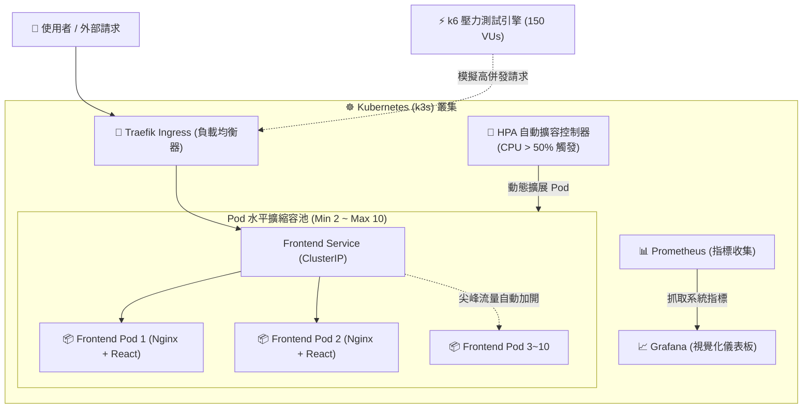

# 🏥 藝康排班系統 (Scheduling System)

[](https://github.com/donut576/scheduling-system/actions)
[](https://k3s.io/)
[](https://www.docker.com/)
[](https://react.dev/)
[](https://www.typescriptlang.org/)
[](https://ant.design/)

基於 **React 18** 與 **TypeScript** 開發的前端排班與派遣管理平台。系統涵蓋任務派工、視覺化時間軸調度、即時合規防護引擎、多階層審批與地理派工等核心功能，支援桌面與行動裝置，底層架構於 **Kubernetes (k3s)** 雲原生微服務與 **Prometheus + Grafana 監控體系**。

---

## 🌐 線上即時體驗 (Live Demo)

- 🔗 **線上 Demo 站點**：[https://scheduling-system-cyan.vercel.app](https://scheduling-system-cyan.vercel.app/)
- 🔑 **快速登入測試帳號**：
  - 👑 **系統管理員 (`Admin`)**：`admin` / `admin123`
  - 👔 **單位主管 (`Manager`)**：`manager` / `manager123`
  - 🧑‍💼 **排班組長 (`Leader`)**：`leader` / `leader123`
  - 👨‍⚕️ **現場專員 (`Staff`)**：`staff` / `staff123`

---

## 🌟 核心特色

- **⏱️ 視覺化排班總覽**：整合 FullCalendar 資源時間軸，提供日／週／月檢視，支援「全區總覽」、「客戶案場」、「組別員工」三大維度彈性調度。
- **🛡️ 智慧排班合規引擎**：前端即時預檢工時上限、連續工作天數、專業證照資格與指定排休衝突，大幅降低人為排班疏漏。
- **👥 精細化四大角色權限 (RBAC)**：針對系統管理員 (`Admin`)、主管 (`Manager`)、組長 (`Leader`) 與現場專員 (`Staff`) 提供客製化工作台與選單權限。
- **⚖️ 特許覆蓋與審批流程**：支援緊急調度的特許覆蓋申請、主管審批駁回防呆與申請人一鍵撤回機制。
- **📬 智慧通知與範本管理**：支援客戶排程通知與員工派工通知範本維護、動態變數插值與即時郵件預覽。
- **🗺️ 全域地理派工檢視**：畫面右下角全域浮球，一鍵展開全區客戶案場據點分布與即時派工位置。

---

## 🏗️ 系統微服務與雲原生架構


---

## 📊 系統可靠性與 6 大監控防禦體系

系統建構了完整的全端 SRE 運維監控體系，保障高併發下的系統穩定：

- **Prometheus + Grafana 視覺化監控**：即時收集 Pod CPU、記憶體與 25 Mb/s 網路頻寬折線圖。
- **HPA 動態水平擴容**：平時維持 2 副本節省主機成本，尖峰時數秒內自動擴展至 10 副本。
- **健康檢查探針 (Probes)**：配置 Liveness (`/`) 與 Readiness (`/`)，實現容器自我修復與零中斷更新。
- **k6 高併發壓力測試**：上線前極限測試，驗證系統在萬級請求下的穩定性。
- **Vercel Analytics & Speed Insights**：監控真實使用者載入速度 (Web Vitals) 與地理訪問量。
- **GitHub Actions Uptime Monitor**：定時主動探測網站健康狀態，異常即時觸發告警。

---

## 🚀 k6 壓力測試與彈性擴展成果 (Benchmark)

針對系統在高負載場景（如全體員工搶班、集中打卡）進行了嚴苛的 **k6 高併發壓力測試**：

### 1. 壓測關鍵指標

| 測試指標 | 測試結果 | 
| :--- | :--- | 
| **總請求量 (Requests)** | **117,497 次** (1,305 QPS) | 
| **請求成功率 (Success Rate)** | **100.00%** (0 失敗) | 
| **平均響應時間 (Avg Latency)** | **15.68 ms** |
| **P95 延遲 (95% 使用者)** | **71.19 ms** | 
| **總傳輸流量 (Data Sent)** | **1.8 GB** | 

---

### 2. HPA 自動水平擴展實錄 (2 ➜ 10 Pods)

當 k6 模擬 150 位併發使用者湧入時，系統偵測到 CPU 使用率飆升，**HPA 自動在數秒內將 Pod 副本數由 2 個擴展至 10 個**：
- **第 1 分鐘**：CPU 2% ➜ REPLICAS: 2 (平時維持低資源運行)
- **第 2 分鐘**：CPU 261% ➜ 流量暴增，觸發 HPA 擴容機制！
- **第 3 分鐘**：CPU 398% ➜ REPLICAS: 4 ➜ 8 ➜ 10 (自動加派 Pod 全力抗壓)
- **第 4 分鐘**：壓測結束 ➜ CPU 降回 2% ➜ 系統恢復平穩

---

## 🛠️ 技術棧 (Tech Stack)

| 類別 | 技術選型 |
| :--- | :--- |
| **核心框架** | React 18, TypeScript 5, Vite 6 |
| **UI 元件庫** | Ant Design 5, @ant-design/icons, Tailwind CSS, Lucide React |
| **時間軸行事曆** | FullCalendar v6 (resource-timeline, timegrid, daygrid, interaction) |
| **地理圖資** | Leaflet, React-Leaflet |
| **路由導航** | React Router 7 |
| **伺服器狀態管理** | TanStack Query v5 (React Query) |
| **全域狀態管理** | Zustand 5 |
| **網路請求** | Axios |
| **日期處理** | Day.js |
| **國際化 (i18n)** | i18next, react-i18next（繁體中文預設、英文） |
| **檔案匯出** | SheetJS (xlsx) |
| **容器化與微服務** | Docker (Multi-stage build), k3s (Lightweight Kubernetes), Helm |
| **監控與 SRE** | Prometheus, Grafana, Alertmanager, HPA (Horizontal Pod Autoscaler) |
| **壓測與效能** | k6 (Load & Stress Testing), Vercel Analytics, Speed Insights |
| **測試框架** | Vitest, React Testing Library, fast-check (Property-Based Testing), MSW |
| **程式碼規範** | ESLint, Prettier, Husky, lint-staged |

---

## 📁 目錄結構

```text
src/
├── api/          # 業務領域 API 模組 (auth, task, schedule, customer, employee, notification)
│   ├── instance.ts # Axios 實例與請求/回應攔截器
│   └── ...       # 各業務領域 API 函式定義
├── components/
│   ├── base/     # 基礎共用元件 (BaseTable, BaseModal, BaseSearchForm, PageErrorBoundary)
│   ├── business/ # 業務元件 (TaskForm, ScheduleCalendar, ConflictPanel, MapView)
│   └── layout/   # 版面元件 (MainLayout, AppHeader, SideMenu, MapFloatingButton)
├── constants/    # 常數定義 (權限碼、角色對照、任務狀態、證照類型)
├── hooks/        # 共用 Hooks (如 useMediaQuery 響應式裝置偵測)
├── i18n/         # 國際化配置 (全站繁體中文 zh-TW 預設、en-US)
├── pages/        # 頁面元件 (login, dashboard, task, schedule, customer, employee, map)
├── queries/      # TanStack Query hooks (各業務領域資料快取與變更管理)
├── routes/       # 路由設定與權限守衛 (guards.tsx、modules/ 依業務切分子路由)
├── stores/       # Zustand 狀態管理 (使用者、權限、任務、排班狀態)
├── styles/       # 設計 Token、Ant Design 主題覆蓋、全域樣式
├── test/         # 測試基礎設施 (setup、MSW mock handlers 與 server)
├── types/        # TypeScript 型別定義 (auth, task, schedule, customer, audit)
├── utils/        # 工具函式庫 (日期處理、警示規則引擎、Excel 匯出、防抖)
├── App.tsx       # 應用程式入口根元件
└── main.tsx      # 渲染入口與 Provider 配置

k8s/              # Kubernetes 雲原生配置清單
├── namespace.yaml # 專案命名空間
├── frontend.yaml  # Deployment 與 ClusterIP Service
├── hpa.yaml       # HPA 自動水平擴縮容配置
└── ingress.yaml   # Traefik Ingress 負載均衡路由

loadtest/         # k6
```
## 🚀 快速開始

### 1. 環境需求

| 工具    | 版本     |
| ------- | -------- |
| Node.js | `>= 18.0` |
| npm     | `>= 9.0`  |

### 2. 安裝與本地開發

```bash
# 安裝依賴
npm install

# 啟動開發伺服器（http://localhost:5173）
npm run dev

# 建置正式版本
npm run build
```

### 3. 執行測試

```bash
# 執行 Vitest 測試套件
npm run test

# 監聽模式（檔案變更時自動重跑）
npm run test:watch
```

### 4. 部署至本地 k3s 叢集

```bash
# 先建立 Namespace，再套用其餘資源
kubectl apply -f k8s/namespace.yaml
kubectl apply -f k8s/frontend.yaml -f k8s/hpa.yaml -f k8s/ingress.yaml
```

> 💡 `namespace.yaml` 必須最先套用，否則其他資源會因 Namespace 不存在而建立失敗。

---

## 🧪 測試架構

專案採用三層測試策略，由下而上逐層保障品質：

| 層級 | 工具 | 驗證範圍 |
| ---- | ---- | -------- |
| **單元測試**（Unit） | Vitest | 工具函式、自訂 Hooks、狀態 Store 邏輯 |
| **元件與整合測試**（Integration） | React Testing Library + MSW | 模擬真實 API 回應，驗證元件互動流程 |
| **屬性基礎測試**（Property-Based） | fast-check | 工時排班演算法、連續排班防呆、資料轉換的數學不變性 |
