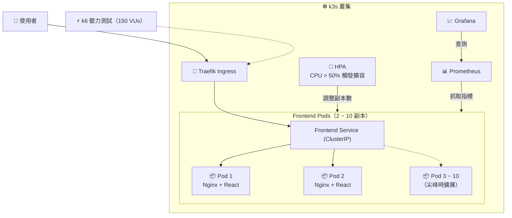

# 🏥 藝康排班系統 (Scheduling System)

[](https://github.com/donut576/scheduling-system/actions)
[](https://k3s.io/)
[](https://www.docker.com/)
[](https://react.dev/)
[](https://www.typescriptlang.org/)
[](https://ant.design/)

以 **React 18 + TypeScript** 開發的排班與派遣管理前端平台，涵蓋任務派工、視覺化時間軸排班、即時合規檢查、多階層審批與地理派工檢視，支援桌面與行動裝置。

專案同時包含一套完整的部署與維運實作：以 **Docker** 容器化、部署於 **k3s**，並透過 **HPA** 自動擴縮容、**Prometheus + Grafana** 監控，以及 **k6** 壓力測試驗證擴展行為。

---

## 🌐 線上 Demo

**網址**：<https://scheduling-system-cyan.vercel.app>

| 角色 | 帳號 | 密碼 |
| ---- | ---- | ---- |
| 👑 系統管理員（Admin） | `admin` | `admin123` |
| 👔 單位主管（Manager） | `manager` | `manager123` |
| 🧑‍💼 排班組長（Leader） | `leader` | `leader123` |
| 👨‍⚕️ 現場專員（Staff） | `staff` | `staff123` |

> 不同角色登入後會看到不同的工作台與選單，建議各切換一次體驗權限差異。

---

## 🌟 核心功能

- **⏱️ 視覺化排班總覽**：以 FullCalendar 資源時間軸提供日／週／月檢視，可依「全區總覽」、「客戶案場」、「組別員工」三種維度切換排班。
- **🛡️ 排班合規檢查**：排班當下即時檢查工時上限、連續工作天數、證照資格與排休衝突，在送出前攔下不合規的排班。
- **👥 角色權限控管（RBAC）**：Admin、Manager、Leader、Staff 四種角色各有專屬工作台，路由與選單依權限動態產生。
- **⚖️ 特許覆蓋與審批**：緊急狀況可提出特許覆蓋申請，支援主管審批／駁回，申請人可在審核前撤回。
- **📬 通知範本管理**：維護客戶排程通知與員工派工通知範本，支援動態變數與即時郵件預覽。
- **🗺️ 地理派工檢視**：右下角浮動按鈕可隨時展開地圖，查看各客戶案場位置與派工分布。

---

## 🏗️ 部署架構



---

## 📊 可靠性與監控

| 項目 | 說明 |
| ---- | ---- |
| **Prometheus + Grafana** | 收集並視覺化 Pod 的 CPU、記憶體與網路流量 |
| **HPA 水平擴縮容** | 平時維持 2 個副本，CPU 超過 50% 時自動擴展，上限 10 個 |
| **Liveness / Readiness Probe** | 容器異常時自動重啟；新 Pod 就緒後才接收流量，達成零停機更新 |
| **k6 壓力測試** | 模擬高併發流量，驗證 HPA 擴展行為與服務穩定性 |
| **Vercel Analytics / Speed Insights** | 追蹤真實使用者的 Web Vitals 與造訪來源 |
| **GitHub Actions Uptime Monitor** | 定時探測 Demo 站點，異常時發出告警 |

---

## 🚀 k6 壓力測試結果

以 k6 模擬 150 位使用者同時存取，觀察系統在高負載下的回應表現與 HPA 擴展過程。

> 目前測試對象為 Nginx 提供的前端靜態資源，主要目的是驗證**容器化部署與 HPA 自動擴展機制**，而非後端 API 的效能。

### 測試指標

| 指標 | 結果 |
| :--- | :--- |
| 總請求數 | **117,497 次**（約 1,305 req/s） |
| 成功率 | **100%**（0 失敗） |
| 平均回應時間 | **15.68 ms** |
| P95 回應時間 | **71.19 ms** |
| 總傳輸量 | **1.8 GB** |

### HPA 擴展過程（2 → 10 Pods）

| 時間 | CPU 使用率* | 副本數 | 狀態 |
| ---- | ---------- | ------ | ---- |
| 第 1 分鐘 | 2% | 2 | 平時低負載 |
| 第 2 分鐘 | 261% | 2 → 4 | 流量湧入，觸發擴容 |
| 第 3 分鐘 | 398% | 4 → 8 → 10 | 持續擴展至上限 |
| 第 4 分鐘 | 2% | 10 → 逐步縮回 | 壓測結束，負載恢復 |

<sub>* CPU 使用率為相對於 Pod `resources.requests` 的百分比，因此會超過 100%。</sub>

---

## 🛠️ 技術棧

| 類別 | 技術 |
| :--- | :--- |
| 核心框架 | React 18, TypeScript 5, Vite 6 |
| UI | Ant Design 5, Tailwind CSS, Lucide React |
| 行事曆／時間軸 | FullCalendar v6（resource-timeline, timegrid, daygrid, interaction） |
| 地圖 | Leaflet, React-Leaflet |
| 路由 | React Router 7 |
| 伺服器狀態 | TanStack Query v5 |
| 全域狀態 | Zustand 5 |
| HTTP | Axios |
| 日期 | Day.js |
| 國際化 | i18next, react-i18next（預設繁體中文，支援英文） |
| 檔案匯出 | SheetJS (xlsx) |
| 容器化與部署 | Docker（multi-stage build）, k3s, Helm |
| 監控 | Prometheus, Grafana, Alertmanager, HPA |
| 效能與壓測 | k6, Vercel Analytics, Speed Insights |
| 測試 | Vitest, React Testing Library, MSW, fast-check |
| 程式碼品質 | ESLint, Prettier, Husky, lint-staged |

---

## 📁 目錄結構

```text
src/
├── api/            # 各業務領域 API（auth, task, schedule, customer, employee, notification）
│   └── instance.ts # Axios 實例與攔截器
├── components/
│   ├── base/       # 共用基礎元件（BaseTable, BaseModal, BaseSearchForm, PageErrorBoundary）
│   ├── business/   # 業務元件（TaskForm, ScheduleCalendar, ConflictPanel, MapView）
│   └── layout/     # 版面元件（MainLayout, AppHeader, SideMenu, MapFloatingButton）
├── constants/      # 權限碼、角色、任務狀態、證照類型
├── hooks/          # 共用 Hooks（如 useMediaQuery）
├── i18n/           # 國際化設定（zh-TW, en-US）
├── pages/          # 頁面（login, dashboard, task, schedule, customer, employee, map）
├── queries/        # TanStack Query hooks
├── routes/         # 路由設定與權限守衛（guards.tsx、modules/）
├── stores/         # Zustand stores（使用者、權限、任務、排班）
├── styles/         # 設計 Token、Ant Design 主題、全域樣式
├── test/           # 測試設定與 MSW mock handlers
├── types/          # TypeScript 型別定義
├── utils/          # 工具函式（日期、合規規則引擎、Excel 匯出、防抖）
├── App.tsx         # 根元件
└── main.tsx        # 進入點與 Provider 設定

k8s/
├── namespace.yaml  # Namespace
├── frontend.yaml   # Deployment + ClusterIP Service
├── hpa.yaml        # HPA 設定
└── ingress.yaml    # Traefik Ingress

loadtest/           # k6 壓力測試腳本
```

---

## 🚀 快速開始

### 1. 環境需求

| 工具 | 版本 |
| ---- | ---- |
| Node.js | `>= 18.0` |
| npm | `>= 9.0` |

### 2. 安裝與本地開發

```bash
# 安裝依賴
npm install

# 啟動開發伺服器（http://localhost:5173）
npm run dev

# 建置正式版本
npm run build
```

### 3. 執行測試

```bash
# 執行所有測試
npm run test

# 監聽模式（檔案變更時自動重跑）
npm run test:watch
```

### 4. 部署至本地 k3s

```bash
# 先建立 Namespace，再套用其餘資源
kubectl apply -f k8s/namespace.yaml
kubectl apply -f k8s/frontend.yaml -f k8s/hpa.yaml -f k8s/ingress.yaml

# 確認部署狀態
kubectl get pods,hpa -n <namespace>
```

> 💡 `namespace.yaml` 必須最先套用，否則其他資源會因 Namespace 不存在而建立失敗。

---

## 🧪 測試架構

採用三層測試策略：

| 層級 | 工具 | 驗證範圍 |
| ---- | ---- | -------- |
| **單元測試** | Vitest | 工具函式、自訂 Hooks、Store 邏輯 |
| **元件／整合測試** | React Testing Library + MSW | 模擬 API 回應，驗證元件互動流程 |
| **屬性基礎測試（PBT）** | fast-check | 排班演算法、連續排班限制、資料轉換的不變性 |
